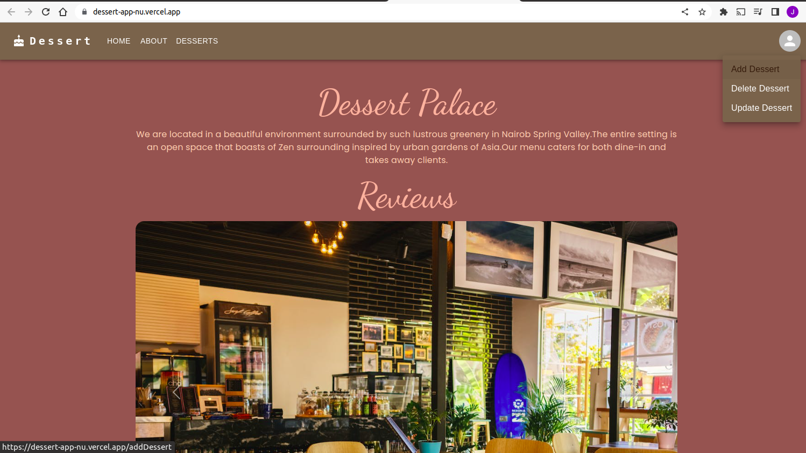

# DESSERT PALACE APPLICATION
#### This is a web application that is used to display desserts which are available in the menu of Desserts palace cafe.All the desserts which are in the db can be accessed by clicking the desserts link on the navbar.CRUD actions for adding ,deleting and updating a dessert can also be performed by tapping on the avatar icon on the navbar.This will display a drop down menu and you can select the action you want to perform.
#### By **John Kamau(Software Developer)**

## Description
This is an application that is used to display desserts which are available in the menu of Desserts palace cafe.As an admin you can add a dessert,delete and update an existing dessert from the database using the back end server which is hosted on Heroku.
## Setup/Installation Requirements
* Clone the repo {git clone https://github.com/JohnKamaujk/Project-Frontend
* Type git clone on your terminal and paste the repo link
* After cloning use VS Code to open the folder.
* Run the application in the code editor using any browser
## Live link
https://johnkamaujk.github.io/Accuweather-app/
## Known Bugs
The app is running flawless with no bugs.
## Technologies Used
* HTML5
* CSS
* React.js
* Visual Studio Code
* Bootstrap
## Support and contact details
If you encounter any issue with the code or you feel you can sugggest additional features to improve the app kindly contact me :
* Phone Number +2547 45419 231
* Email Address johnjkkamau@gmail.com
### License
This is under the [MIT](LICENSE) license
Copyright (c) 2022 **Made by John Kamau**
